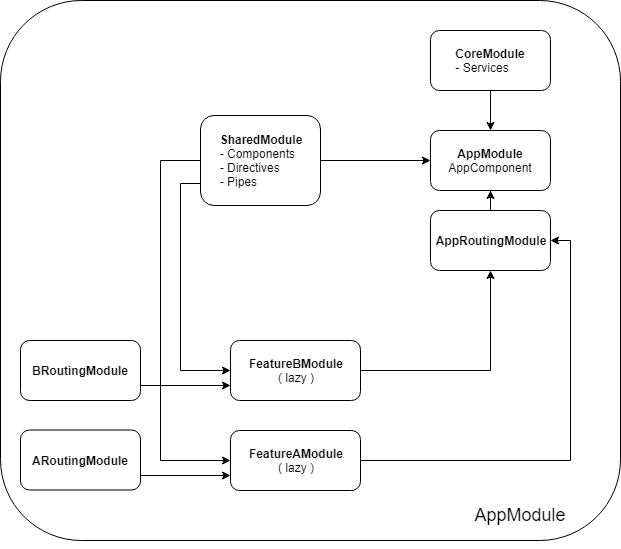

# Angular Practice Starter

This project was originally generated with [Angular CLI](https://github.com/angular/angular-cli) version 6.0.8.

## Features
 - Following official [angular styles guide](https://angular.io/guide/styleguide) and some personal experiences.
 - Good practice to import and use [Angular Material](https://angular.io/guide/styleguide).
 - Managing username/password authentication.
 - Using [Tradingview](https://www.tradingview.com/chart/) with naive official sample, branch [`feature/tradingview`](https://github.com/dang1412/angular-practice-starter/tree/feature/tradingview)
 - Using [Ccex-api](https://github.com/dang1412/ccex-api) (library that wrapping crypto exchanges api) including Tradingview with realtime datafeed from exchanges, branch [`feature/ccex-api`](https://github.com/dang1412/angular-practice-starter/tree/feature/ccex-api).

 ## TODO
  - Using [D3Js](https://d3js.org/), branch `feature/d3`.
  - Using Firebase authentication.
  - Using Google Drive storage.
  - Using AWS S3.
  - ... Please tell me more.

## Overall structure

`AModule -> BModule` means that module A is imported inside module B declaration file (directly import or via lazy route definition).

<p align="center"></p>

Inside a feature module we may have a single component or have the whole structure same to its parent app module.

## Some explanations

### Add material
 - Include font style `src/index.html`
```
<link href="https://fonts.googleapis.com/icon?family=Material+Icons" rel="stylesheet">
```
 - Include prebuilt theme style `src/styles.scss`
```
@import '~@angular/material/prebuilt-themes/deeppurple-amber.css';
```
 - Create separate angular material import module file `src/shared/material.module.ts`

## Code scaffolding

Run `ng generate component component-name` to generate a new component. You can also use `ng generate directive|pipe|service|class|guard|interface|enum|module`.

Generate module, page components (associated directly with a route), presentation components (used in page components with input, output).

```
ng g module feature-modules/feature-awesome
ng g component feature-modules/feature-awesome/pages/my-page --skip-import
ng g component feature-modules/feature-awesome/components/first-component --skip-import
``` 

## Run, build and test

Run `ng serve` for a dev server. Navigate to `http://localhost:4200/`. The app will automatically reload if you change any of the source files.

Run `ng build` to build the project. The build artifacts will be stored in the `dist/` directory. Use the `--prod` flag for a production build.

Run `ng test` to execute the unit tests via [Karma](https://karma-runner.github.io).

Run `ng e2e` to execute the end-to-end tests via [Protractor](http://www.protractortest.org/).

[Angular CLI README](https://github.com/angular/angular-cli/blob/master/README.md).

## Contributing
If you have any comment or desired sample feature, welcome to create issue. I will check them all and try to be helpful as much as possible.
